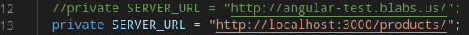

## Versão dos pacotes instalados
```sh
    #run
    ng --version && npm v bootstrap

    # result
    # Angular CLI: 12.2.1 
    # Node: 14.17.4 
    # Package Manager: npm 6.14.14 
    # OS: linux x64 
    # bootstrap@5.1.0
```


<br>

## Fake api para testes, instalação e inicialização

<i> Devido a problemas de C.O.R.S (Cross-Origin Resource Sharing) na API
hospedada, houve a necessidade de implementação de um servidor na 
maquina local com objetivo de ajudar na implementação das requisições. </i>

<br> 

```sh
    sudo npm install -g json-server
    json-server --watch src/api/fake-api/bd.json
```

<i> Assim as seguintes linhas precisam ser descomentadas/comentadas  em /src/api/api.services.ts:

<br>

